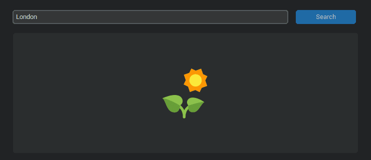
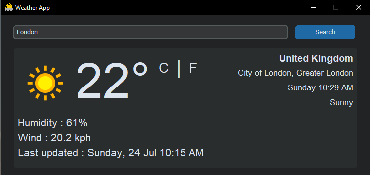
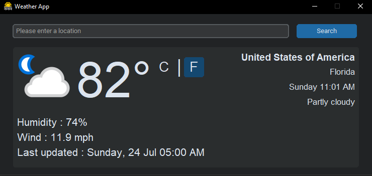
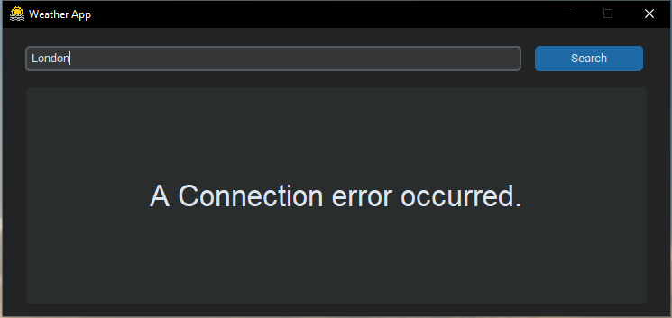

# WeatherApp

a simple weather app made with **Tkinter** and a free **Weather API**

## How it was made

- For the GUI i used [Tkinter](https://docs.python.org/3/library/tk.html) library with [CustomTkinter-UI](https://github.com/TomSchimansky/CustomTkinter) that was made by [Tom Schimansky](https://github.com/TomSchimansky) to get better visuals and make the application look a bit more modern.

- For the API i used one that you can get for free here [Weather Api](https://www.weatherapi.com/) and [requests](https://requests.readthedocs.io) library to handle _requests_ i guess.

## App Preview

### Application preview

| _Getting the weather for London_

### Some error handling

| _Handling missing user input_

| _Handling server side errors_

| _Handling connection errors_
